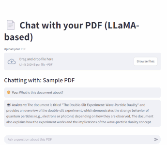

# PDF Chatbot with LLaMA


## Overview

A powerful PDF chatbot application that allows users to upload PDF documents and ask questions about their content. Built with Streamlit for the frontend and leveraging LLaMA-based models for natural language processing, this application provides an intuitive interface for document-based question answering.

## Features

📄 Upload and process PDF documents

💬 Chat interface for asking questions about document content

⚡ Fast response generation using LLaMA-based models

🧠 Context-aware answers based on document content

🎨 Clean, user-friendly interface

🔍 Sample PDF with demo questions included

## Installation

1. Clone the repository:

```bash
git clone https://github.com/Muzenda-K/PDF-Chatbot.git
cd pdf-chatbot
```

2. Create and activate a virtual environment (recommended):

```bash
python -m venv venv
source venv/bin/activate  # On Windows use `venv\Scripts\activate`
```

3. Install the required dependencies:

```bash
pip install -r requirements.txt
```

## Usage

1. Run the Streamlit application:

```bash
streamlit run app.py
```

2. The application will open in your default browser at `http://localhost:8501`
3. Either use the provided sample PDF or upload your own document
4. Start asking questions about the document content

## Project demo



## Project structure

pdf-chatbot/
├── app.py # Main Streamlit application
├── pdf_utils.py # PDF text extraction utilities
├── vector_store.py # Vector store implementation
├── tiny_llama.py # LLM interaction module
├── requirements.txt # Python dependencies
├── sample.pdf # Sample PDF document
├── LICENSE # Project license
└── README.md # This file

## Contributing

Contributions are welcome! Please follow these steps:

1. Fork the repository
2. Create your feature branch (git checkout -b feature/AmazingFeature)
3. Commit your changes (git commit -m 'Add some AmazingFeature')
4. Push to the branch (git push origin feature/AmazingFeature)
5. Open a Pull Request

## License

Distributed under the MIT License.
